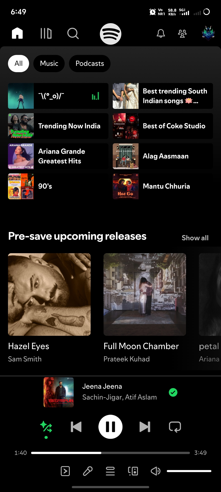
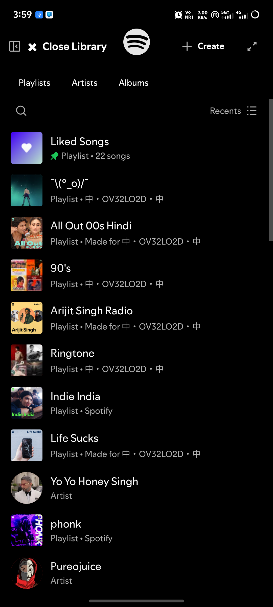
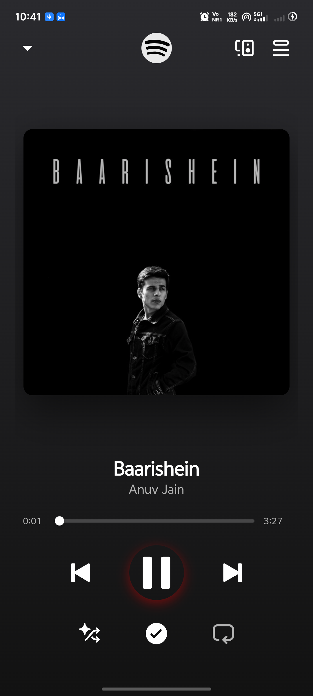
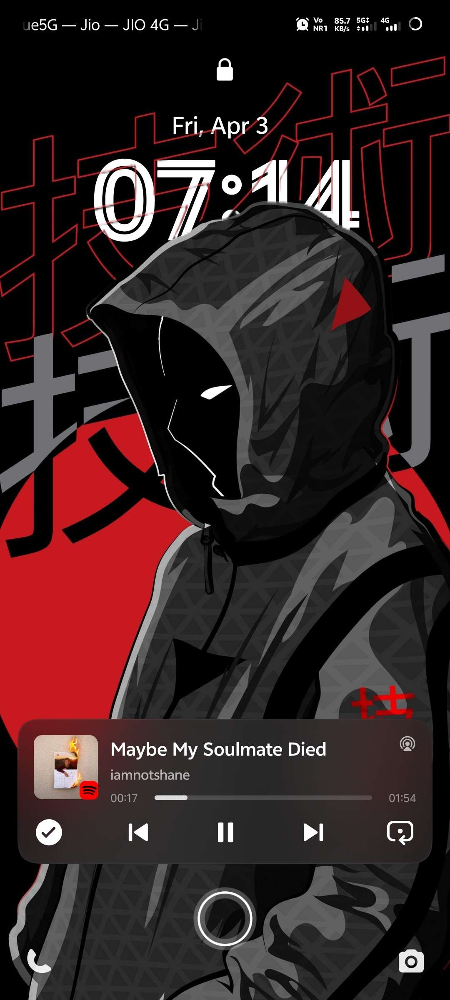
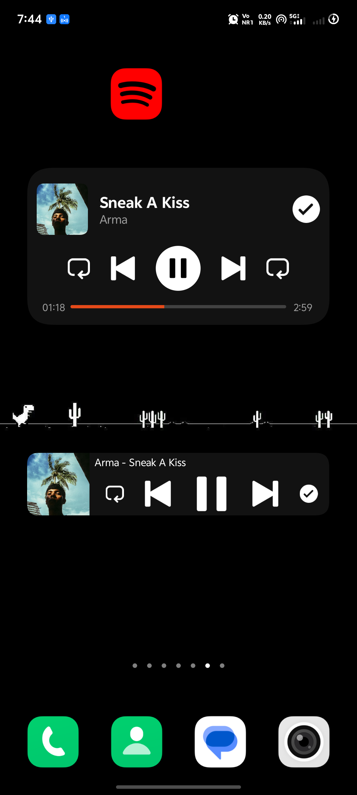
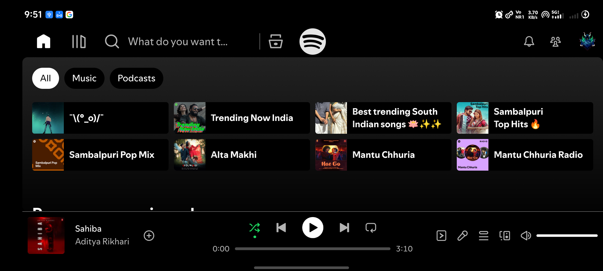

  

<h1 align="center">SpotiDuck Releases 🦆</h1>

  

  

  
  
  

> [!WARNING]
> **Official Source Only:** SpotiDuck is **only** published and distributed on this official GitHub repository. Do not download or trust builds of this application from any other websites, app stores, or third-party channels, as they are unverified and may contain malicious modifications.

Welcome to the download and releases page for **SpotiDuck**—a high-performance, web-wrapped Spotify client for Android featuring built-in ad-blocking, media controls, and widgets.

By wrapping the Spotify Web Player in a highly optimized Android WebView, SpotiDuck combines the full feature set of Spotify's web browser experience with native Android integrations—such as background service control, built-in ad-blocking, lock screen media sessions, widgets, and Android Auto.

> [!NOTE]
> **Credits:** SpotiDuck is built upon and inspired by **Spotifuck**, the original unofficial Android Spotify web wrapper developed by **deviato**. We would like to express our gratitude to the original creator for laying the groundwork for this project.

---

## 📸 App Interface Showcase

  
  
  

  
  

  

---

## ⚠️ Compatibility & Playback Warnings

The application might not function correctly under the following conditions:

1. **Account Limitations**: Free accounts may experience playback loading errors on mobile WebViews. While SpotiDuck includes settings to handle platform compatibility, server-side changes to player browser policies may affect playback stability.
2. **Third-Party Logins**: Google or Facebook sign-ins may occasionally block authentications inside embedded browsers. Adjusting the compatibility configuration or user-agent scaling in settings may resolve these sign-in hurdles.
3. **DRM & Media Pipelines**: Secure media playback requires device-level DRM support. Custom ROMs or devices lacking proper security certifications may fail to start media streams.
4. **Aggressive Filters**: Loading custom or overly restrictive filter blocklists in settings can block essential server endpoints, preventing tracks from playing.
5. **System WebView Version**: For proper compatibility with preloading and layout adjustments, keep your device's System WebView updated to the latest version via the Google Play Store.