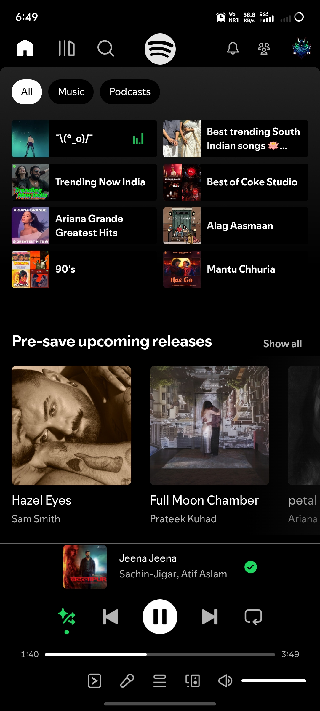
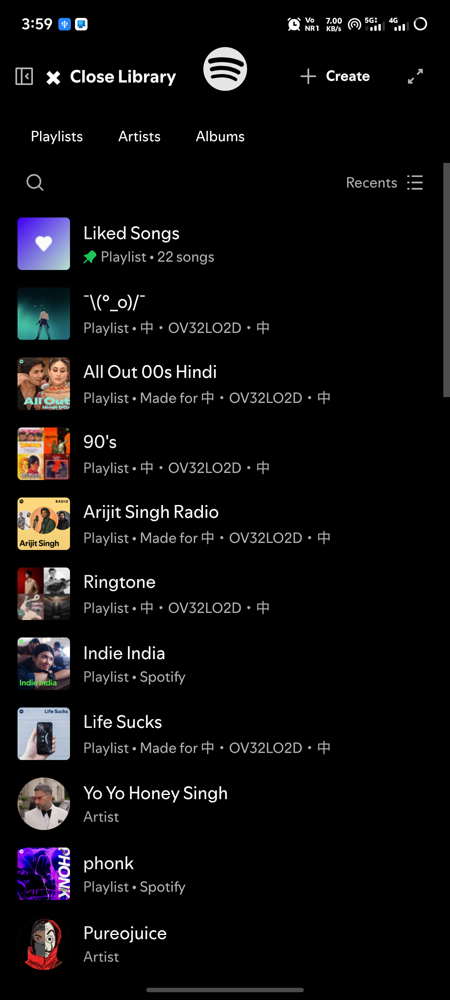
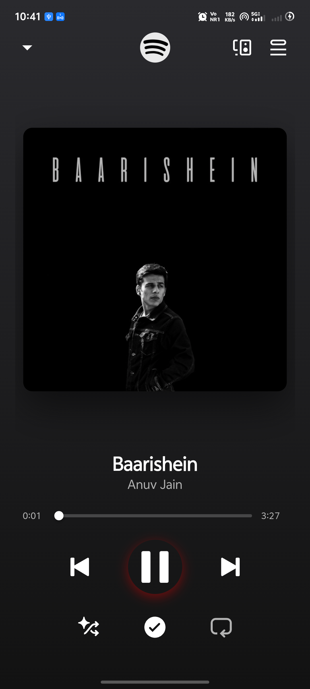
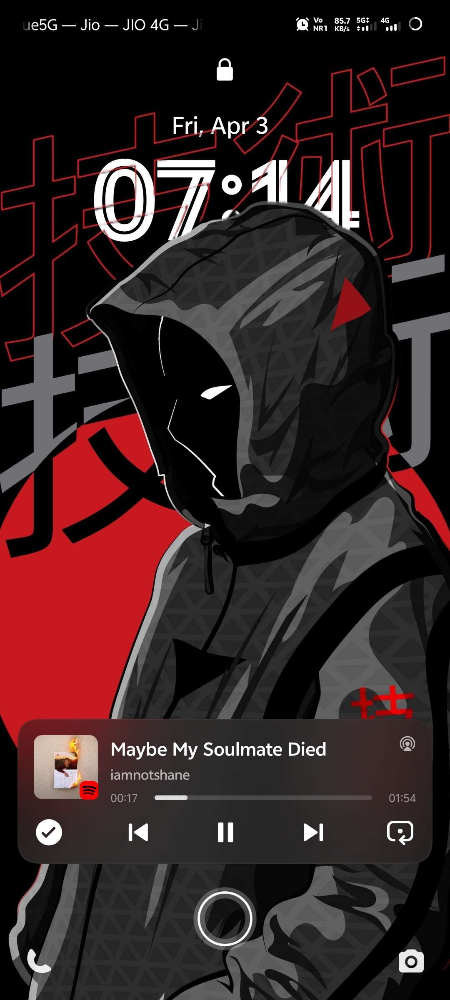
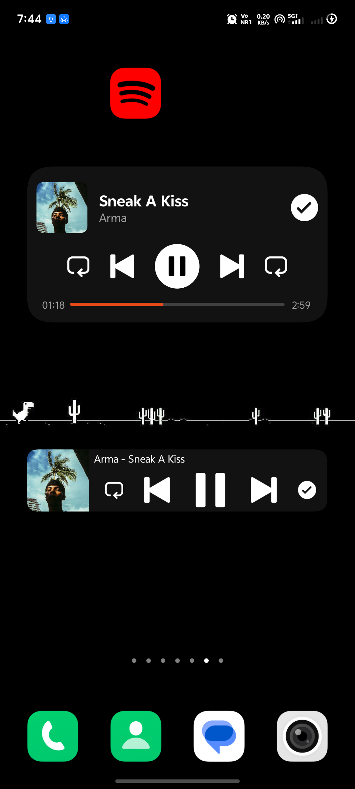

<p align="center">
  
</p>

<h1 align="center">SpotiDuck 🦆</h1>

<p align="center">
  <a href="https://github.com/RMNO21/SpotiDuck/releases/latest">
    
  </a>
  <a href="https://discord.gg/NNXDGZEDFs">
    
  </a>
</p>

<p align="center">
  
  
  
</p>

---

Welcome to **SpotiDuck**—a high-performance, native-like web client for Spotify featuring built-in ad-blocking, intelligent connection retry management, download & cache progress tracking, and offline Service Worker resilience.

By wrapping Spotify in an optimized native App Shell (PWA), SpotiDuck delivers a fast, desktop-grade Spotify experience with seamless native controls—eliminating the clunky "bare WebView" feel.

---

## ⚡ Key Features

* **⚡ Native App Shell & UI**: Modern glassmorphic interface with bottom navigation, responsive tabs, smooth micro-animations, and custom dark mode styling.
* **📡 Intelligent Connection Lost & Retry Engine**:
  * Real-time network detection with non-intrusive alert banners.
  * Automatic retry countdowns with exponential backoff strategy.
  * Manual "Retry Connection" button to instantly test network reachability.
* **📥 Download & Cache Progress Manager**:
  * Displays active and cached downloads, track sizes, percentage progress, and transfer speeds.
  * Total downloaded size metrics and cache-clearing management.
* **🛡️ Built-in Ad-Blocking & User-Agent Emulation**: Bypasses mobile WebView playback restrictions by disguising traffic as modern desktop client sessions.
* **📶 Live Spotify Health Monitoring**: Integrated status checks for Spotify Client Token, OAuth Auth, REST API, Widevine DRM, and Edge CDN endpoints.
* **📲 Progressive Web App (PWA)**: Standalone display mode, Service Worker cache-first offline support, and installable app manifest (`manifest.json`).

---

## 📸 App Interface Showcase

<p align="center">
  
  
  
</p>

<p align="center">
  
  
</p>

---

## 🛠️ Local Development & Testing

You can run the native app shell locally using any HTTP server:

```bash
# Python
python -m http.server 8080

# Node.js
npx http-server -p 8080
```

Open `http://localhost:8080` in your browser to launch the SpotiDuck App Shell.